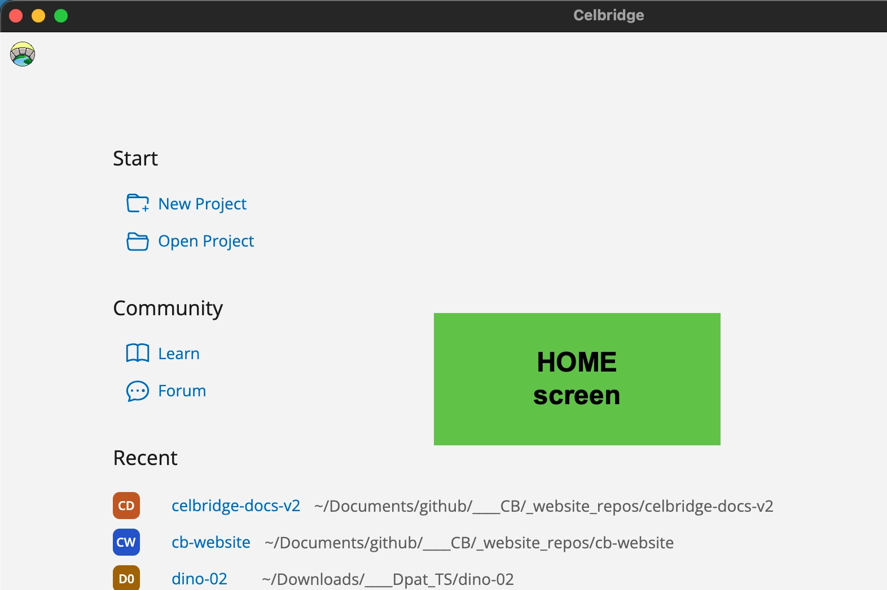
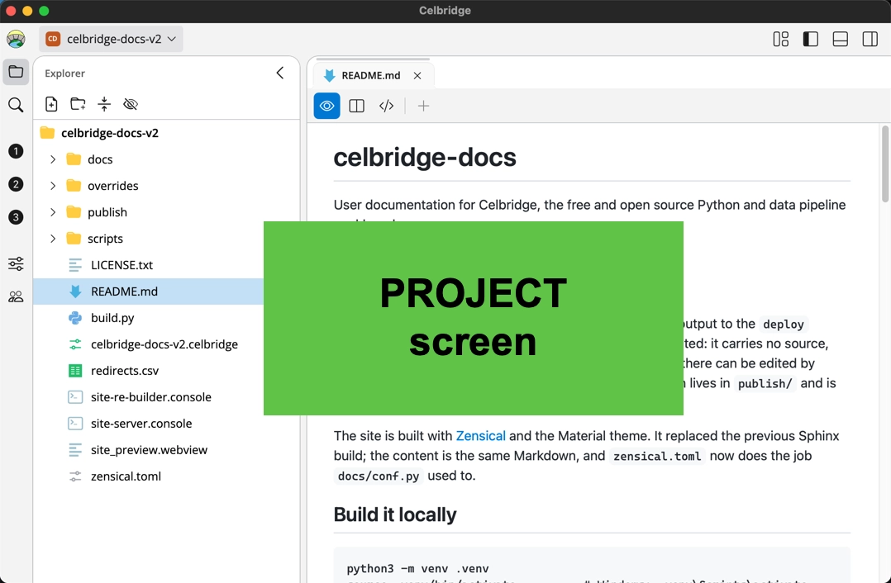
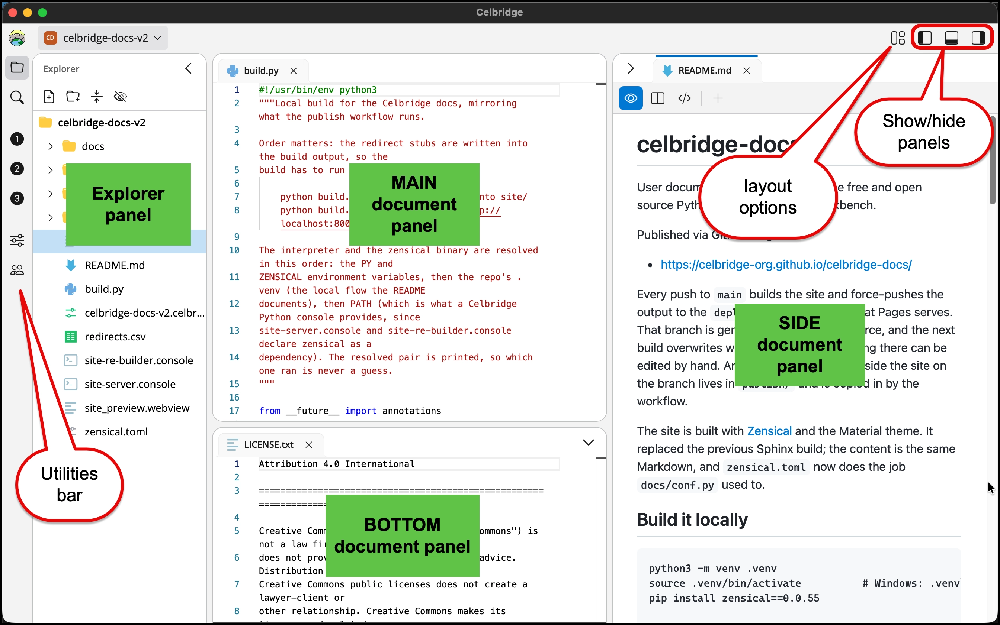
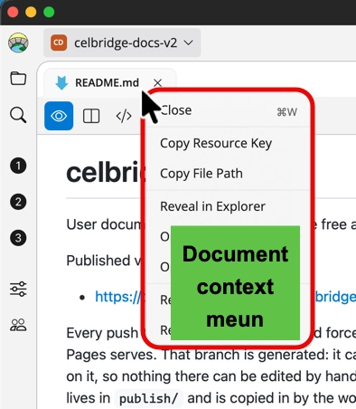

# Getting started with Celbridge { #doc_getting_started }

Welcome to Celbridge. This part of the docs will help you get to know your way around the application.

!!! note

    This document assumes you've already successfully installed Celbridge. For detailed installation instructions, see the [Installation](../02_setup/installation.md#doc_installation) page.

## The Basics

Celbridge has two main interfaces: 
- the **home screen**, where you create and open projects, 
    - you'll only see this page if no project is currently open in Celbridge

- The **Project screen**, where you work directly in a project
    - you'll spend almost all your time working on an open project in this screen

## Creating a Project

You can **create and open Celbridge projects** from either the **home menu**, or the **hamburger menu** at the top of the navigation bar to the left of the main interface.

Let's create a project from the home menu.

1. Open the File menu.
2. Click `New project`.
3. Name your project.

!!! note

    Currently, project names cannot contain spaces.

4. Choose a folder to place your project in, and select whether you want Celbridge to create a subfolder with the same name as the project.

    - creating a folder for a new project is the default option that will be selected.

The steps to create a project from the hamburger menu are identical: 

- just click the menu and select `New project`.

## The Celbridge Editor

Let's explore the Celbridge editor.

When you are working with an open project, fFrom left to right, top to bottom, the sections of the Celbridge editor are as follows:

### Utilities Bar

- The **Explorer** list the project resources (files and folders)

- The **Search utility** allows you to search for text within project files

- The **Custom shortcuts and utilities** If any custom utility packages or document shortcuts are declared in the project, icons for them will appear below the magnifiying glass icon of the Search utility

    - in this sample Celbridge project screenshot, there are no custom utilities, but there are 3 custom document shortcuts, with icons "1", "2" and "3" 

- The **Project Settings** lets you change project settings.

- The **Community** icon will open a web view document, whose home page is the **Celbridge** project home page, and also with bookmarks for the project's docuemntation (**Learn**) and community **Forum**

### Explorer Panel

- The **explorer panel** lists all files in the project. **Add existing files by dragging and dropping** them from the Windows File Explorer.

- Open a file by right-clicking it and selecting `Open`.

- Perform various options on files using the `Edit` option.

- **Add a new file or folder** by right-clicking anywhere in the Explorer panel and selecting an option from the `Add` dropdown. The supported options are a folder, Python script, Excel file, Markdown file, web application file, or plain text file of any format.

- Open a file in the Windows File Explorer | macOS Finder using the `Open in` option.

- If you have an open **Python console** document, then you can also run Python files using the `Run` content menu option. Right-click on a Python file in the Explorer panel and select `Run`. The open **Python console** document prints any output from the script.

### Document Panels (Main, Bottom, Side)

- View and edit open documents in the document panels. **Double-click on a file** in the explorer panel to **open it** in the documents panel.

- You can tab between multiple open documents.

- Celbridge includes a fully-featured text editor based on [Monaco](https://microsoft.github.io/monaco-editor/), the editor used in [Visual Studio Code](https://code.visualstudio.com/).

- The text editor supports all popular text formats and programming languages.

- The documents panel also provides a live preview for Markdown.

!!! note

    Right-mouse clicking over a document tab will show the document's context menu:

    

