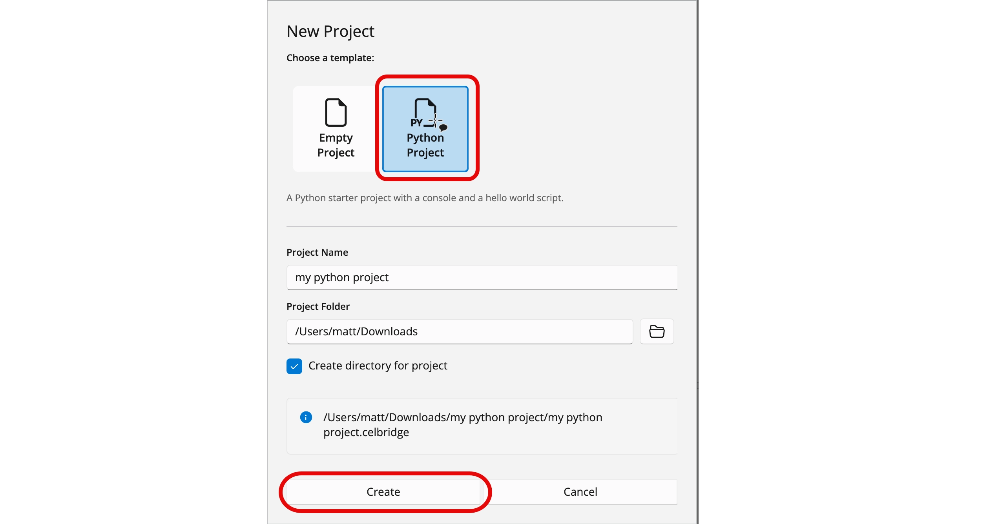
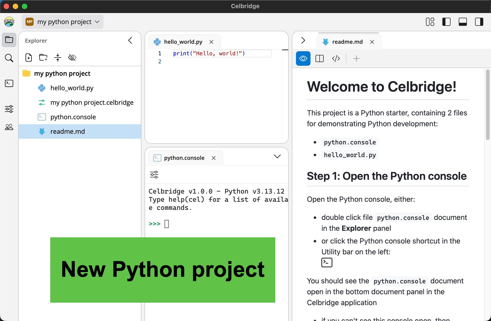

# The Python template Project

Each Celbridge release includes an Python template project that offers a basic hello world Python starter script and a Python console document. Access this example project as follows:

1. Launch Celbridge.
2. From the home menu, click `New project`.
3. Select `Python project` template.
4. Choose a suitable folder and project name.
5. Click Create.

3. Enter a name for the example project (e.g. "my_python_project") and select a location for it.
4. Celbridge will generate a new Python project. 

You should now have a proejct with several examples, each in their own directories:

