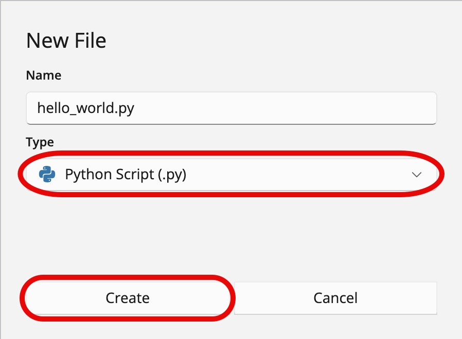
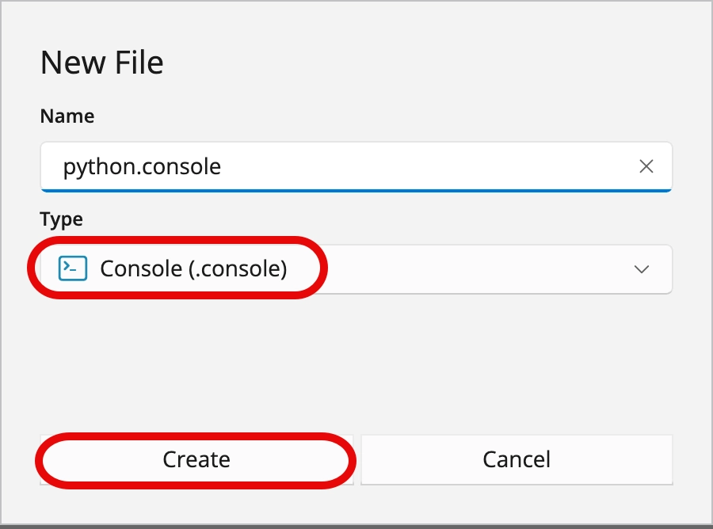
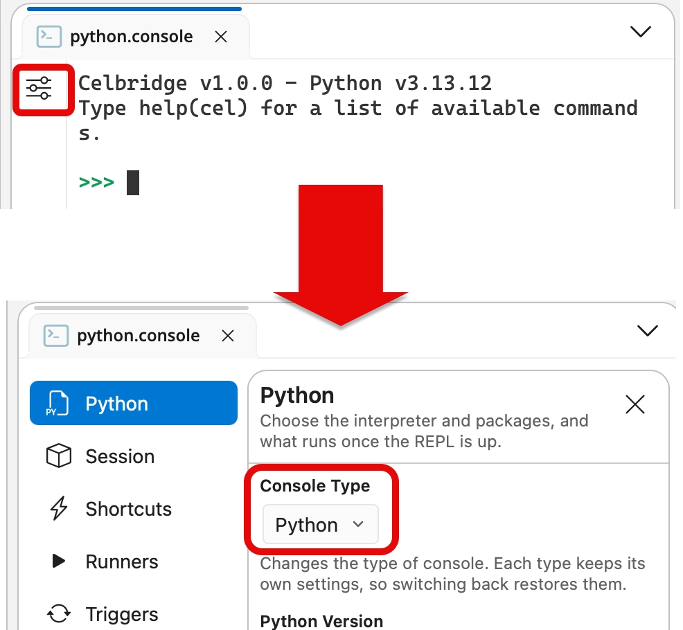
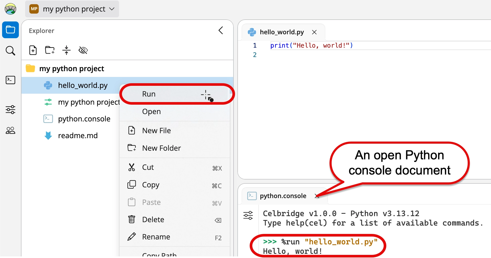

# Hello World (Python programming)

This use case example shows you how to create and run a simple Python script.

## Create a new, empty Python file

1. Create a new Celbridge project (or use an existing one).
2. Right-mouse click in the file explorer and choose to add a new Python file named **hello.py**:

- choose menu: **File | New File**
- enter the file name as **hello_world.py**
- choose type: **Python Script (.py)**

{ width="50%" }

## Edit the Python file

1. The new Python script file should be created and appear in the file explorer panel.
1. Edit your new script, by double clicking on file **hello.py** in the file explorer panel:

    - the file should open in the code editor in the Documents panel

5. Type the following simple Python **print** statement:

   > ```
   > print("hello world")
   > ```

   > !!! note
   >     There is no need to click anything to **save** your edits - since Celbridge automatically saves your changes as you type

## Create/Open a Python console document
If you started this project as a Python project, you'll already have a `python.console` Python console document in your project.

If you don't have a Python console document:

1. Create a new Console document named `python.console`

    - choose menu: **File | New File**
    - enter the file name as **`python.console`**
    - choose type: **Console (.console)**

    { width="50%" }

1. Open the Console document & ensure its **type** is Python

    - open the console settings
    - select **Python** from the **Console Type** dropdown menu

    { width="50%" }


## Run the Python file

1. Run your Python script. 

    - A simple way to do this is by right-mouse clicking in the file explorer over file **hello_python.py**, and choose the **Run** option.

1. In the Python console document you should see the CLI comment **%run "hello_world.py"** followed by the text "hello world" printed out on the next line.

{ width="75%" }

Congratulations - you've created and executed a Python script using Celbridge!
