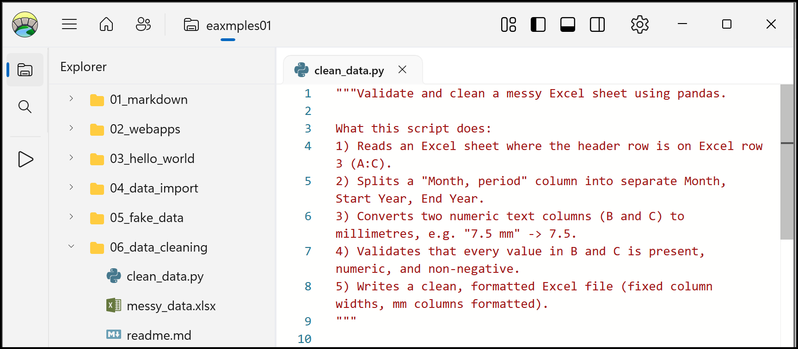

# Celbridge Docs

!!! attention "Work in progress — Celbridge is still in **early development**"

    Any update may introduce incompatibilities with previous versions or breaking
    architectural changes, so always back up any data before upgrading.

    Check the status of the Celbridge project at the project's
    [GitHub site](https://github.com/celbridge-org/celbridge/).

Welcome to the official documentation pages for
[Celbridge](https://www.celbridge.org/), the free and open source community-driven
Python and data pipeline workbench application.

The table of contents in the sidebar should let you easily access the documentation
for your topic of interest. You can also use the search box at the top of the page.

Here's a screenshot of Celbridge in action:

You can find the source for these docs at
[celbridge-org/celbridge-docs](https://github.com/celbridge-org/celbridge-docs).
