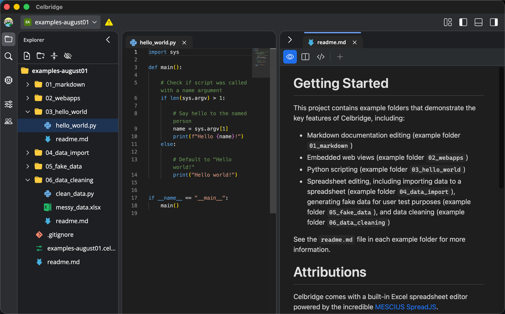

# Celbridge Docs

Welcome to the official documentation pages for
[Celbridge](https://www.celbridge.org/), the free and open source community-driven workbench application.

Here's a screenshot of Celbridge in action:

You can find the source for these docs at
[celbridge-org/celbridge-docs](https://github.com/celbridge-org/celbridge-docs).

!!! note

    The docs website source is itself a Celbridge project (dogfooding :-)

 